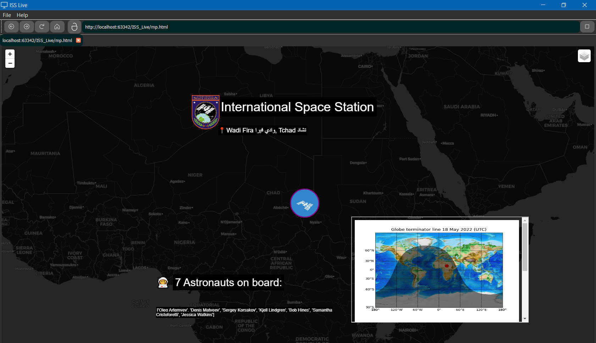
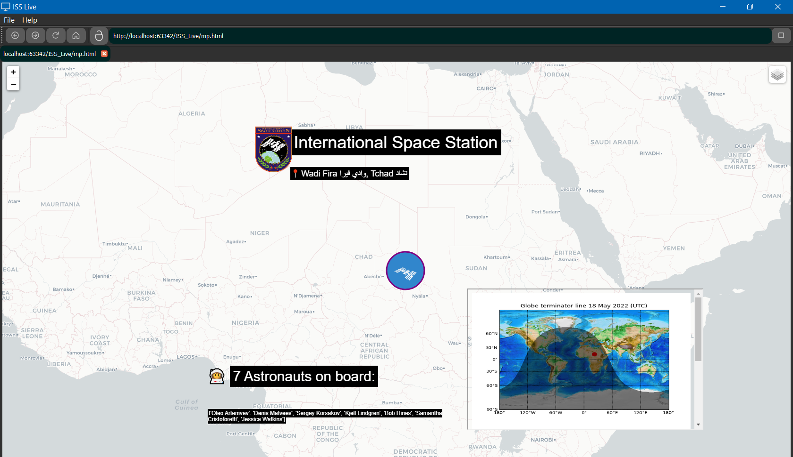
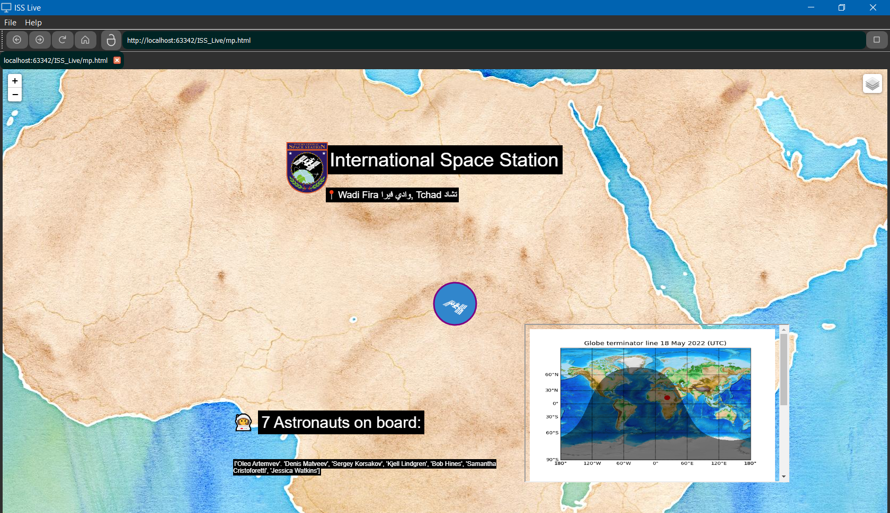
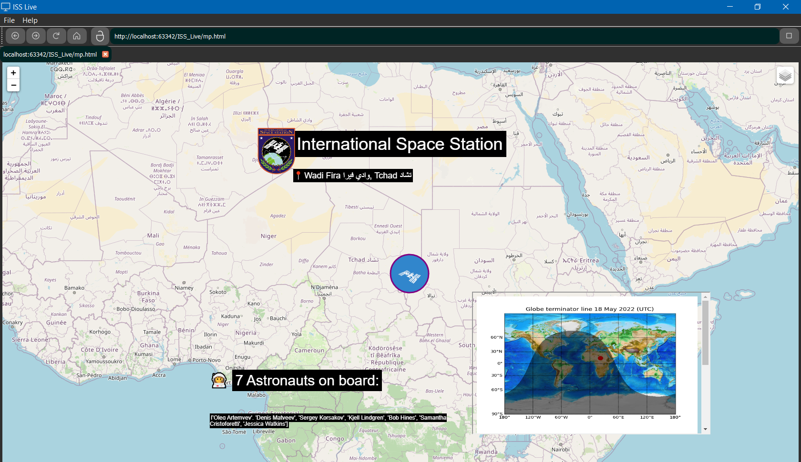
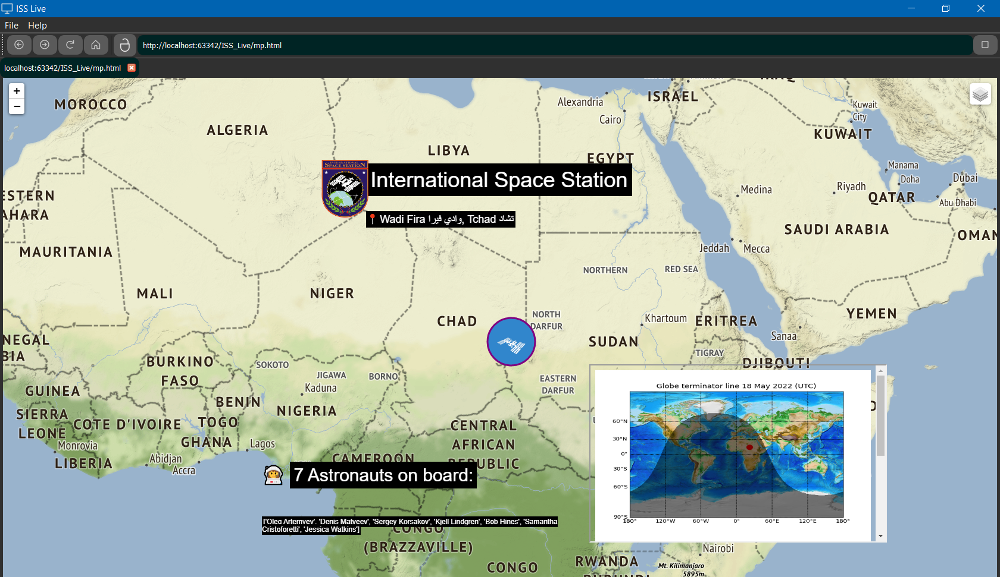

# ISS Monitoring


> Add some filters, look at the current location and enjoy the view :)

<br/>


## 💻 Requirements

Before we start, please verify if you have:

* `Python 3` or more.
* A ` Windows ` machine.

<br/>
<br/>

## ⚙ Installing dependencies

````
os
sys
PyQt5
pandas
folium
geopy
tzwhere
datetime
pytz
base64
io
numpy
mpl_toolkits
matplotlib
````
> Do it easily just with ` pip install <dependence> ` for each one.

<br/>
<br/>
<br/>

## 🚀 Getting started

### Customization
Here are simple customizations for your viewer.

<br/><br/>


<div style="text-align:center">
  <h2>🎨 Map Themes</h2>
</div>

<!-- The four columns -->
<p align="center">
Dark Earth - 'cartodbdark_matter'    &     White Earth - 'cartodbpositron'
<br/>

    
<p align="center">
Vintage - 'stamenwatercolor'    &     Street Map - 'openstreetmap'
<br/>


<p align="center">
Earth Relief - 'stamenterrain'
</p>
<a align="center">

  

</a>


  
</div>


* You can also change the default zoom rate but, remember to fix the position (or the size) of the ISS image on the maker.

> Check this feature on the line 74.


<br/><br/>

## ✨ Extra
I really recommed the usage of the Live Browser here, it takes a better view of the map, so you can go for a next level with this:

<h3 align="center"> pyinstaller </h3>
<br/>

```
pip install pyinstaller
```

<h4 align="center"> Standalone Python EXE Executable - Tutorial</h4>
<h6 align="center">(Click on this image below)</h6>

<p align="center">
    <a href="https://www.youtube.com/watch?v=QWqxRchawZY">
    </a>
</p>
<p align="center">
  <a href="https://pyinstaller.org/en/stable/">
    Docs
  </a>
</p>


> Make both python files executable with pyinstaller and run it in a simple way.


<br/><br/><br/><br/><br/><br/>

## 📫 Contribute

1. Fork this repo.
2. Create a branch: `git checkout -b <branch_name>`.
3. Make your code and: `git commit -m '<commit_message>'`
4. Send to the original branch: `git push origin ISS_Monitoring / main`
5. Make a pull request.


